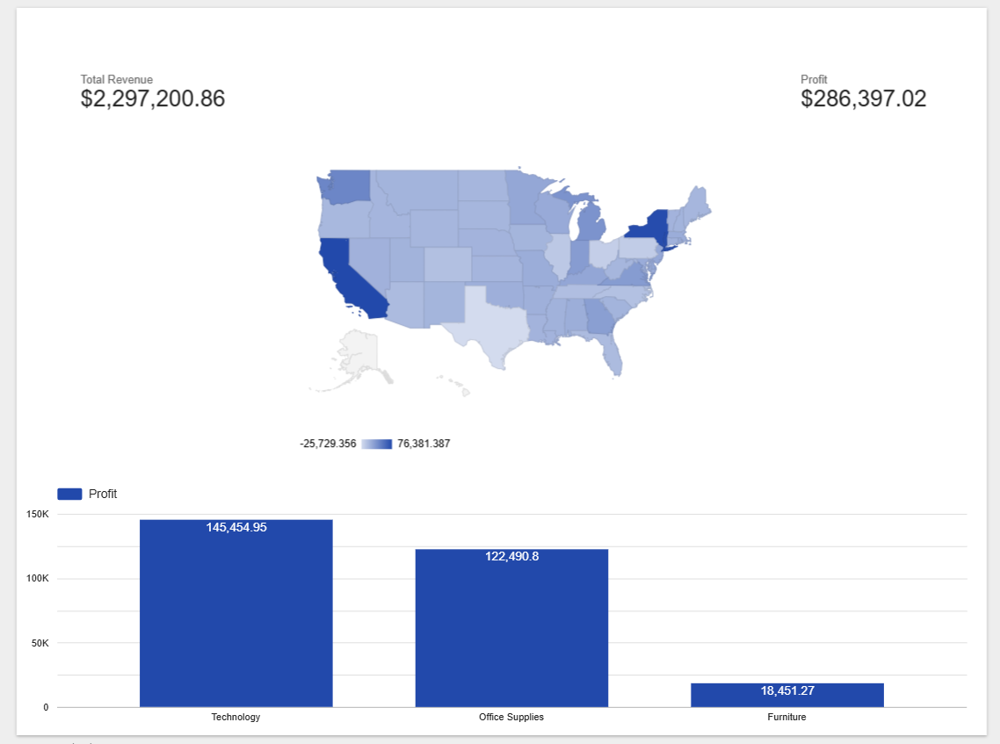
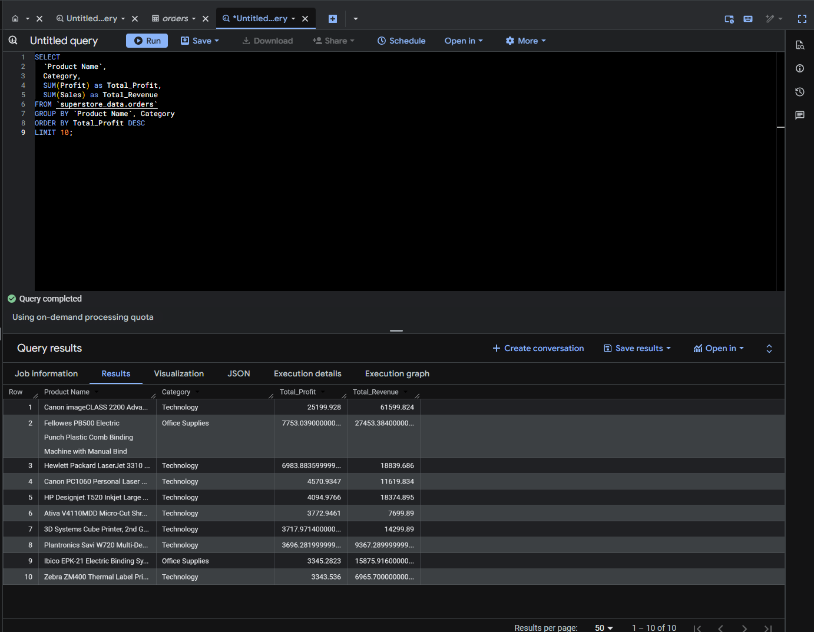
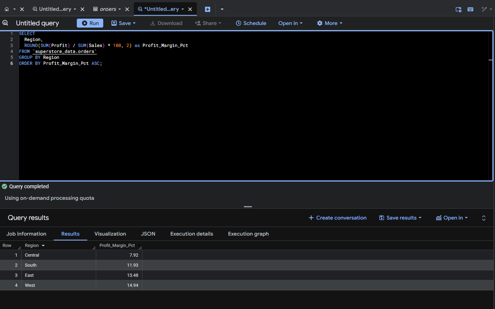
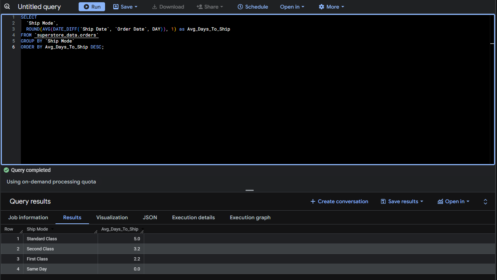

# Global Superstore Supply Chain Analysis

Role: Data Analyst
Tools: SQL (BigQuery), Google Looker Studio
Domain: E-Commerce / Retail / Logistics

## Project Overview
This project analyzes sales data from a global superstore to identify profit leaks and optimize shipping performance. Using Google BigQuery for data warehousing and SQL for analysis, I processed over 10,000 order records to answer critical business questions regarding product profitability and regional performance.

## Interactive Dashboard
[Click Here to View the Live Interactive Dashboard] https://lookerstudio.google.com/s/gaxNFIYYAW0

## Key Findings
* Profitability: 'Technology' products drive 40% of total profit, while 'Furniture' is operating at a significant loss in the Central region.
* Regional Analysis: The 'Central' region has the lowest profit margins due to heavy discounting.
* Logistics: 'Same Day' shipping is performing well, but 'Standard Class' averages 5.2 days, lagging behind industry benchmarks.

## SQL Analysis
### 1. Identifying Top Profitable Products
Aggregated sales and profit by product category to identify high-value inventory.

### 2. Regional Profit Margin Analysis
Calculated profit margins ((Profit/Sales)*100) to detect underperforming regions.

### 3. Shipping Performance Check
Analyzed the delta between Order Date and Ship Date to measure logistics efficiency.

